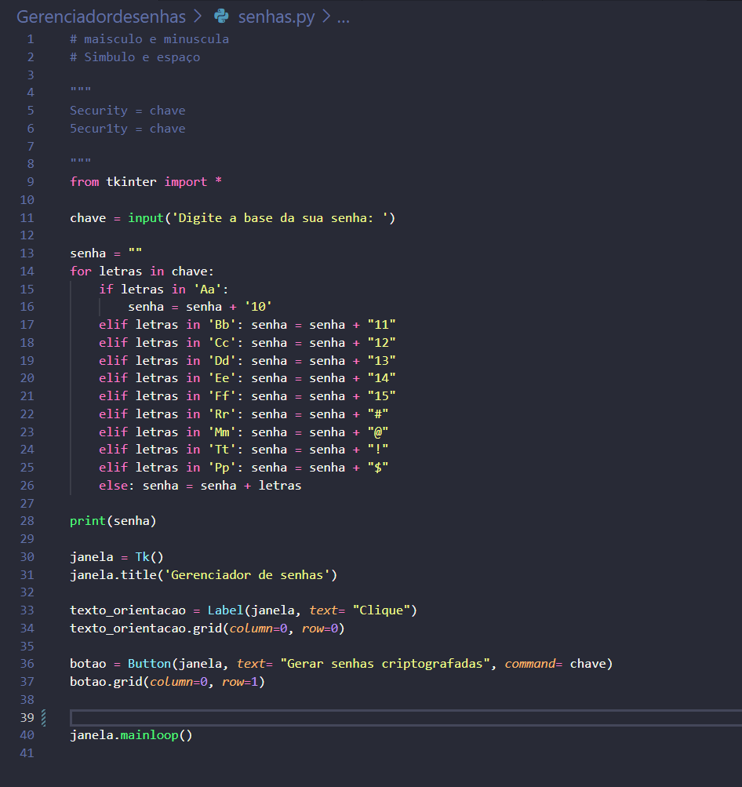

# Geredor de senhas com Criptografia
## Projeto em desenvolvimento by Marcos P
### Imagens do projeto 

# Conversor de Moeda

 Um conversor de moeda que usa uma API 
 Topicos do projeto:
 1. Definindo a chave da API e URL base
 2. Função de conversão de moeda
 3. Solicitação da API
 4. Verificação do status da API
 5. Extração dos dados de câmbio
 6. Obtenção da taxa de câmbio das moedas
 7. Verificação de moedas inválidas
 8. Realização da conversão
 9. Captura de dados do usuário
 10. Tratamento de erro para o valor
 11. Exibição do resultado

